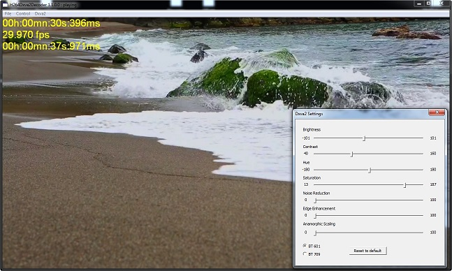
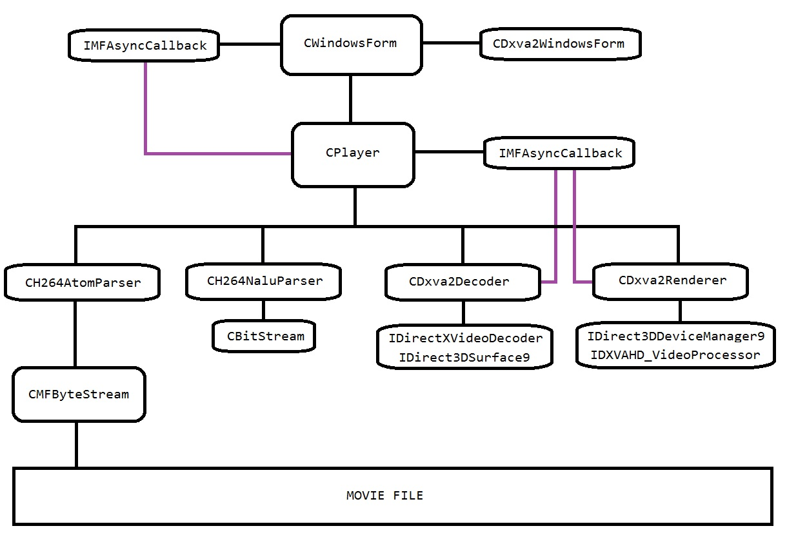

# H264Dxva2Decoder

## Program

This program parses mp4 file (avcc/avc1 format only), then parses NAL Unit, decodes slices using IDirectXVideoDecoder, then display pictures using IDirectXVideoProcessor. This program just uses Microsoft Windows SDK for Windows 7, visual studio community 2017, Mediafoundation API and C++ (optional Directx SDK (june 2010)). You need at minimum Windows Seven, and a GPU able to fully hardware decode h264 video format. This program does not implement all h264 features, see limitations below.

## Windows OS executable

If you are not software enginer, or do not want the source code, you can try the executable. Feedbacks are welcome, especially with AMD GPU cards.

Minimal configuration :
* Windows Vista/Windows7/Windows8/Windows10
* A graphic card with DXVA2_ModeH264_E GPU mode (you can use some tools like DXVA Checker to know if your GPU is compliant)
* The Microsoft Visual C++ 2017 Runtime (x86/x64) installed

Movie file :
* Open .mp4 or .mov files extension
* Only the first video track found will be played
* The audio is not processed
* Subtitles are not processed

Using the video player :
* Drag and drop movie file, or with Menu : File->Open File
* Enter/Exit fullscreen : double click on movie
* Keyboard
  * escape : exit fullscreen
  * space : play/pause
  * p : play
  * s : stop
  * f : enter/exit fullscreen
  * right arrow : step one frame
  * numpad 0 : seeks forward 10 minutes
  * numpad 1 : seeks forward 1 minutes
  * numpad 2 : seeks forward 2 minutes
  * numpad 3 : seeks forward 3 minutes
  * numpad 4 : seeks forward 4 minutes
  * numpad 5 : seeks forward 5 minutes
  * numpad 6 : seeks forward 6 minutes
  * numpad 7 : seeks forward 7 minutes
  * numpad 8 : seeks forward 8 minutes
  * numpad 9 : seeks forward 9 minutes
* Menu -> Dxva2 Settings
  * Brightness
  * Contrast
  * Hue
  * Saturation
  * Noise Reduction
  * Edge Enhancement
  * Anamorphic Scaling
  * BT601/BT709
  

## limitations

### GPU
* only tested DXVA2_ModeH264_E GPU mode
* minimal GPU for NVIDIA cards -> Feature Set C (VP4) see https://en.wikipedia.org/wiki/Nvidia_PureVideo
* the GPU decoding is OK with NVIDIA GeForce 700 series
* the GPU decoding is OK with Intel HD Graphics 4000 and 510

### ATOM
* just uses the first video track found
* partial sync sample atom is not handled
* multiple stds atom are not handled
* edts/elst atoms are not handled
* does not handle inconsistent timestamps
* does not handle moof atom (fragmented mp4)

### NALU
* NaluLenghtSize == 1 is not handled (never encountered such mp4 file)
* just handles NAL_UNIT_CODED_SLICE and NAL_UNIT_CODED_SLICE_IDR, ignore others
* normally, uses same variable name as h264 spec : good for comparing and implementing
* needs a better check of min/max values according to h264 spec
* pic_order_cnt_type == 1 is not handled (never encountered such mp4 file)
* frame_mbs_only_flag is not handled
* rbsp_trailing_bits is not used (don't see any problem right now)
* num_slice_groups_minus1 is not handled
* redundant_pic_cnt_present_flag is not handled
* pic_scaling_matrix_present_flag is not used
* memory_management_control_operation is not used
* SP/SI slice type are not handled
* only handles chroma_format_idc == 1

### DECODING
* only used DXVA_Slice_H264_Short, not DXVA_Slice_H264_Long (GPU must handle it) see ConfigBitstreamRaw
* no interlacing
* video only (no audio processing)
* complete gpu acceleration only, no software fallback
* long term reference and list reordering are not handled (never encountered such mp4 file)

### DISPLAY
* SetVideoProcessStreamState should use values from mp4 file, here default for all
* just use D3DFMT_X8R8G8B8 output format and D3DFMT_NV12 input format

## Software Design

### Class diagram

